# Curso de Fundamentos de Estadística y Análisis de Datos con Python

## Modulo 1 Introducir conceptos básicos del curso

### Clase 1 Introducción al curso

Mapa de Trabajo

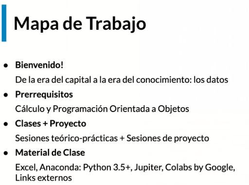

### Clase 2 Pensamiento estadístico para programadores

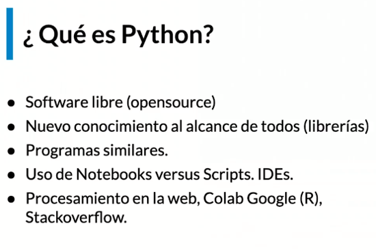

#### Ejercicio con jupyter Sesion 2

Vemos un breve repaso sobre jupyter notebook y python, uso de modulo OS,Un resumen de Pandas, Breve vistazo a TensorFlow

### Clase 3 Conceptos clave sobre estadística

#### Ejercicio con jupyter Sesion 3

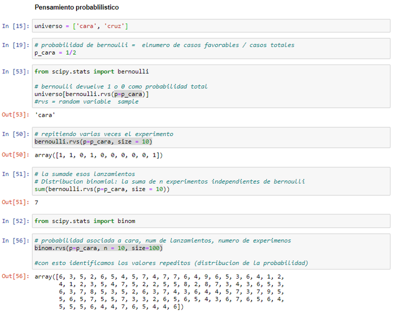

## Modulo 2 Caracterizar información a traves del análisis exploratorio

### Clase 4 Medidas de tendencia central

#### Ejercicio con jupyter Sesion 4

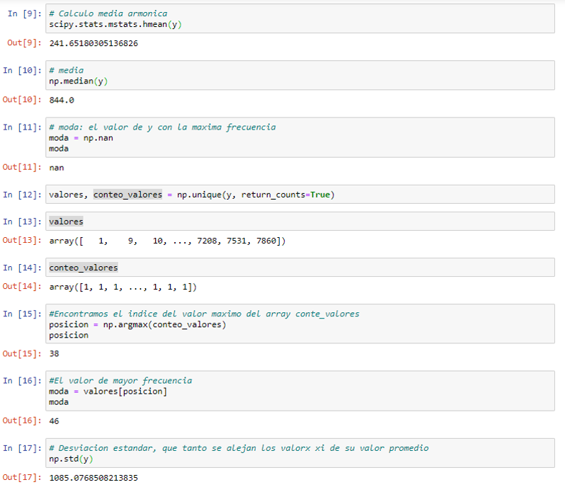

### Clase 5 Diagramas de frecuencias para variables continuas y discretas

Diagramas de Frecuencia o Histogramas

- **Variables categoricas:** Tablas de Frecuencia
- **Variables numericas:** Percentiles, Decils, Quintiles y Quartiles, outliers o valores extremos

Un **percentil** es una medida estadística utilizada para comparar datos. Consiste en un número de 0 a 100 que indica el porcentaje de datos que son igual o menor que un determinado valor. Los percentiles son muy conocidos por su uso en los percentiles de crecimiento. Por ejemplo, si el peso de un bebé está en el percentil 65, quiere decir que el 65% de los bebés de la misma edad pesan igual o menos.

Los percentiles son muy conocidos por su uso en los percentiles de crecimiento. Por ejemplo, si el peso de un bebé está en el percentil 65, quiere decir que el 65% de los bebés de la misma edad pesan igual o menos.

#### Ejercicio con jupyter Sesion 5

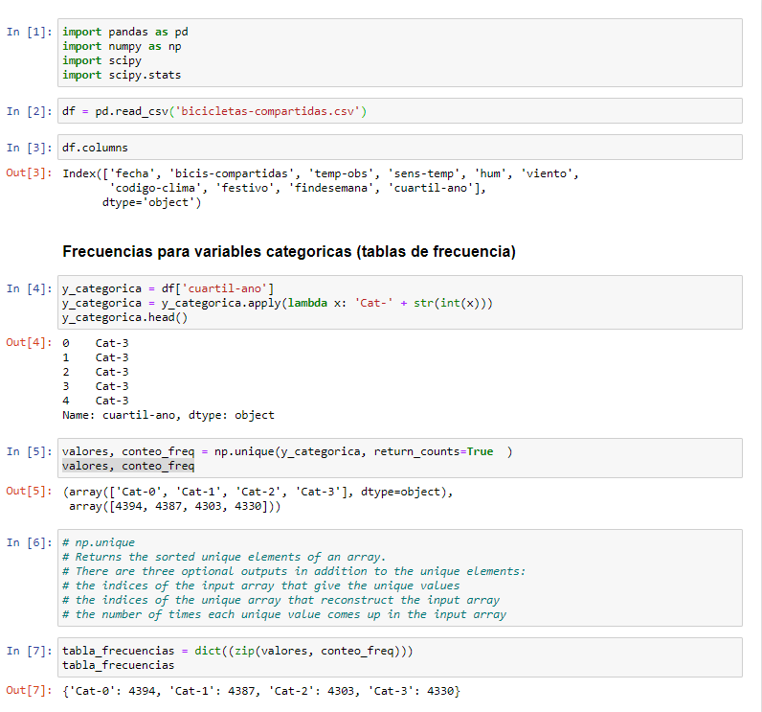

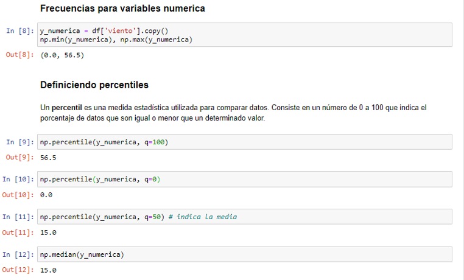

### Clase 6 Visualizacion de datos usando Python

#### Ejercicio con jupyter Sesion 6

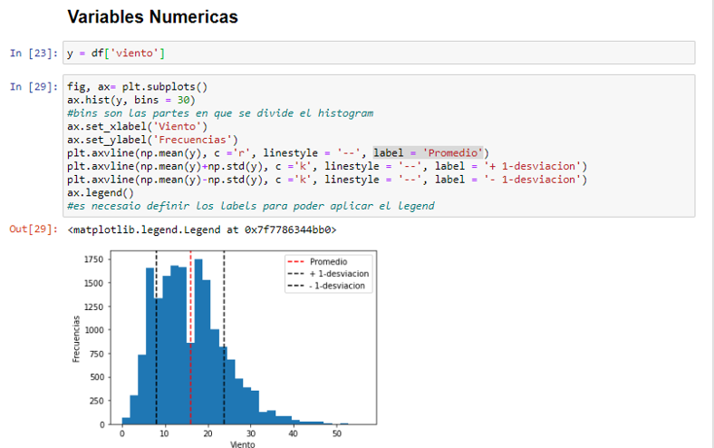

### Clase 7 Boxplt y scatterplot

Éstas dos gráficas son ampliamente usadas en el análisis estadístico, nos permite visualizar la relación de dos variables conjuntas. Podemos ver la correlación entre las dos variables.

hemos hablado de los cuartiles y como estos van apermitirnos aproximarnos a la distriucion de una variable, los boxplots seran graficamente la representacion de estos cuartiles

## Modulo 3 Aplicar conceptos de probabilidad a eventos aleatorios

### Clase 8 Probabilidad condicional - Teorema de Vayes

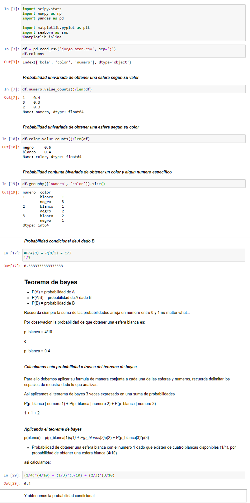

### Clase 9 Funciones de distribución discreta y continua

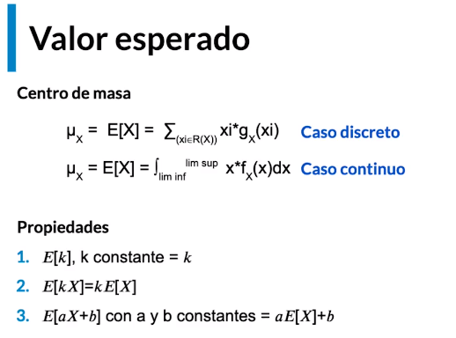

#### Ejercicio con jupyter Sesion 9

### Clase 10 Funciones de distribucion discreta y continua con Python

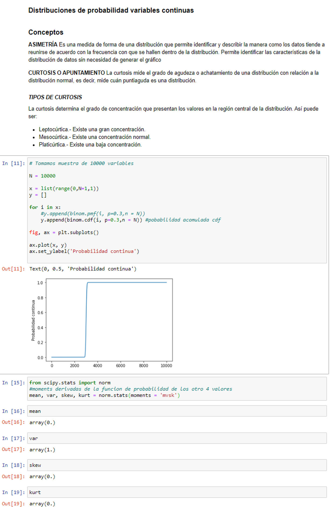

### Clase 11 Distribuciones de mayor aplicacion discretas

Distribuciones de mayor aplicacion discretas

1. Distribucion de **Bernoilli** (experimento binario asociado a exito o fracaso) modela una variable binaria  1 o 0.
2. Distribucion **Binomial**: Es la suma de variables aleatorias de Bernoulli con N ensayos Bernoulli queremos contar el numero de exitos x asociados.
3. Distribucion **Geometrica**: Numero de ensayos x hasta 1 exito.
4. Distribucion **Binomial Negativa**: Es una generalizacion de la distribucion geometrica, donde vamos a contar el numero de ensayos x hasta el k-esimo exito.
5. Distribucion de **Poisson**: Numero de llegadas N a una longitud de tiempo t.

#### Sesion 11 Jupyter

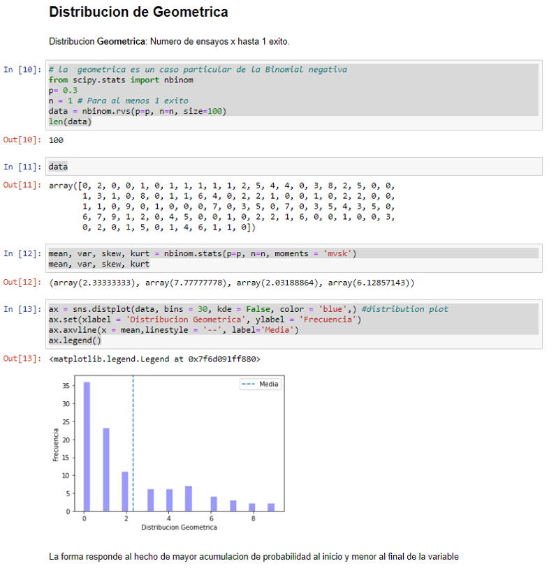

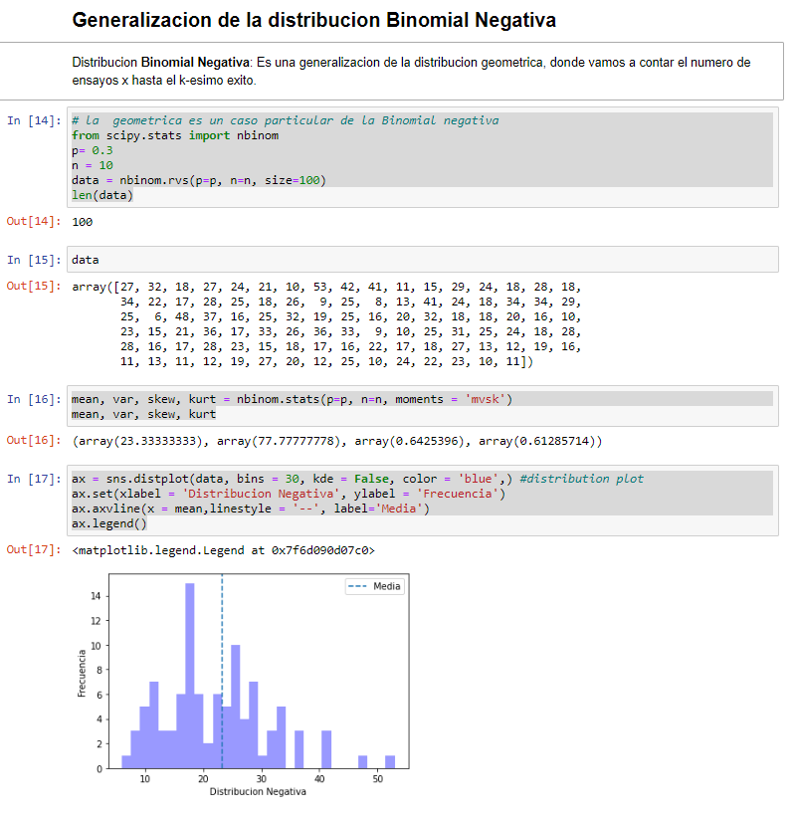

### Clase 12 Distribuciones de mayor aplicación continuas

- Distribucion **Exponencial**: Es el caso inverso de Poisson, aqui contamos el tiempo que nos toma llegar a uno de esos eventos.
- Distribucion **Normal**
- Distribucion **Uniforme**

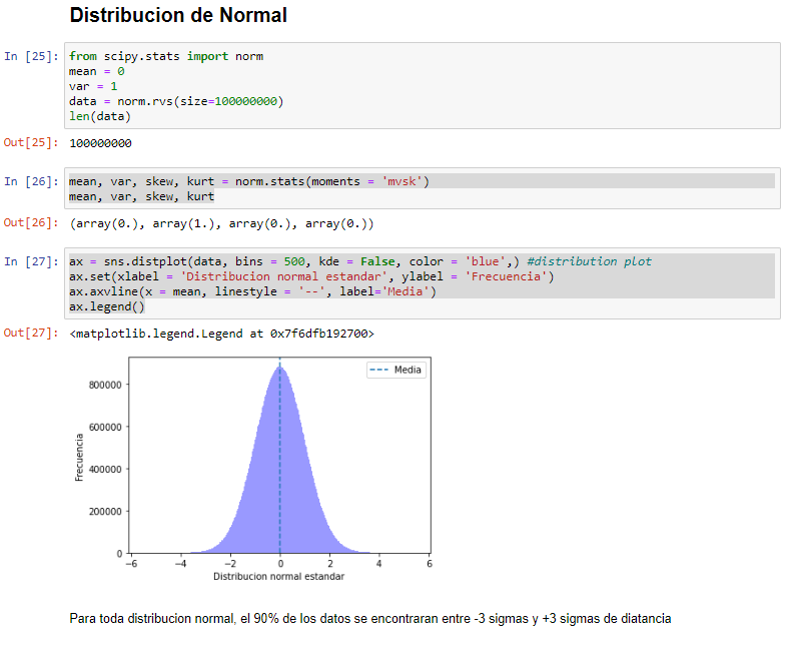

### Clase 13 Estandarización, covarianza y correlación

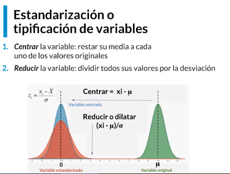

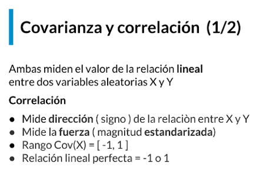

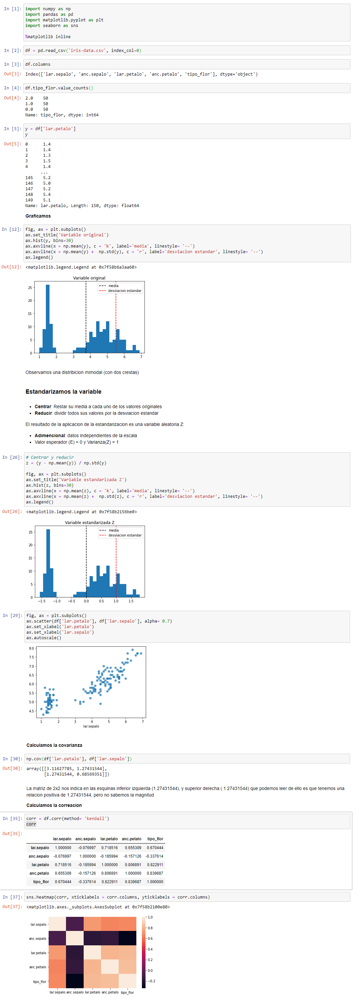

## Modulo 4 Construir conceptos estadísticos analíticos

### Clase 14 Estimadores a través de datos
